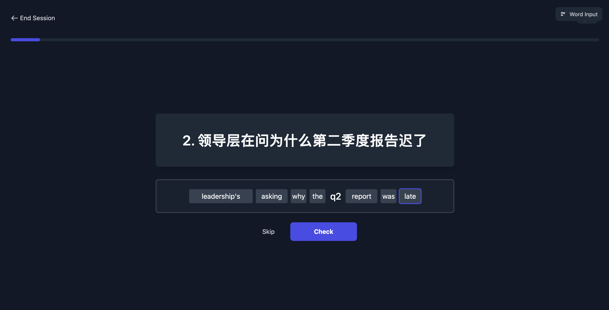
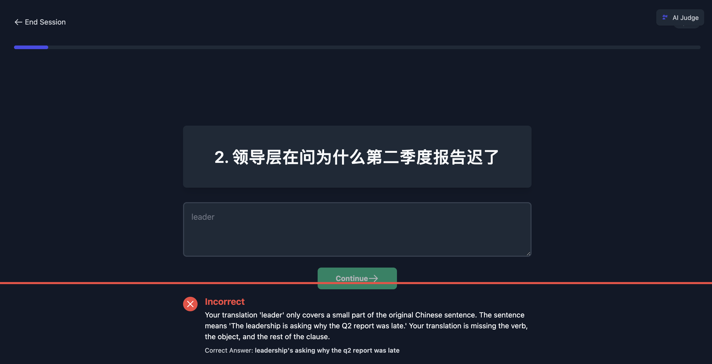

# FluentFlow AI - AI 赋能的英语学习应用

[](https://github.com)
[](https://opensource.org/licenses/MIT)
[](https://reactjs.org/)
[](https://ai.google.dev/)

**FluentFlow AI** 是一款革命性的智能英语学习应用，旨在通过人工智能的力量帮助您高效掌握英语句子。它将科学的间隔重复记忆法与 Google Gemini 前沿的人工智能技术相结合，为您提供个性化的翻译练习、智能反馈和重点词汇提取，让语言学习变得前所未有的智能和高效。

## ✨ 应用截图

| 书库主页 (Library View) | 学习模式 (Study Session) |
| :---: | :---: |
|  |  |
| **AI 智能反馈 (AI Feedback)** | **创建学习本 (Book Creator)** |
|  |  |

## 🚀 功能特性

-   **🤖 智能创建学习卡片**: 只需粘贴中文句子，AI 将自动为您翻译成地道的英文，一键生成学习卡片集。您也可以直接导入中英双语对照文本。
-   **🧠 艾宾浩斯记忆曲线**: 内置基于艾宾浩斯遗忘曲线的间隔重复系统 (Spaced Repetition System)，在您即将忘记时智能安排复习任务，最大限度地提高记忆效率。
-   **💡 AI 智能评判**: 告别死板的单词匹配！Gemini AI 能够理解您翻译的句子含义。即使您的答案与标准答案不完全一样，只要意思正确，AI 也能判定为正确，并给予鼓励。
-   **📝 个性化反馈与纠错**: 当您翻译错误时，AI 不仅会给出正确答案，还会提供简洁明了的解释，告诉您错在哪里以及如何改进，帮助您真正理解。
-   **📚 自动生成生词本**: AI 会自动从您答错的句子中提取核心词汇，并生成您的专属生词本，让您能集中精力攻克难点。
-   **🎯 多种学习模式**:
    -   **学习模式 (Study Mode)**: 学习新卡片和到期应复习的卡片。
    -   **复习错题 (Review Mistakes)**: 专门针对您反复出错的句子进行强化训练。

## 🛠️ 技术栈

-   **前端**: React 19, TypeScript, Tailwind CSS, Vite
-   **后端**: Node.js, Express, SQLite
-   **核心 AI**: Google Gemini API (`@google/genai`)
-   **数据存储**: SQLite 数据库 + Browser `localStorage`

## 📋 系统要求

-   Node.js >= 16.0.0
-   npm >= 8.0.0
-   Google Gemini API Key

## 🚀 快速开始

### 1. 克隆项目

```bash
git clone https://github.com/TCcodecode/english-learning-app.git
cd english-learning-app
```

### 2. 安装依赖

```bash
npm install
```

### 3. 配置环境变量

创建 `.env` 文件并添加您的 Gemini API Key：

```env
VITE_GEMINI_API_KEY=your_gemini_api_key_here
```

> 💡 **获取 Gemini API Key**: 访问 [Google AI Studio](https://aistudio.google.com/app/apikey) 免费获取 API Key

### 4. 启动应用

#### 方式一：完整启动（推荐）
同时启动前端和后端服务：

```bash
npm run dev:full
```

#### 方式二：分别启动
如果需要分别启动前端和后端：

```bash
# 终端1：启动后端服务器
npm run server

# 终端2：启动前端开发服务器
npm run dev
```

### 5. 访问应用

打开浏览器访问：`http://localhost:5173`

## 📖 使用指南

### 创建学习书籍

1.  在 **书库 (Library)** 页面点击 **"创建新书"** 按钮
2.  选择创建方式：
    -   **AI 翻译中文**：粘贴中文内容，AI 自动翻译成英文
    -   **导入双语**：粘贴 `中文 === English` 格式的文本
3.  填写书名并点击 **"创建"**

### 开始学习

1.  在书库中选择您创建的书籍
2.  点击 **"学习"** 开始新学习或复习到期卡片
3.  点击 **"复习错题"** 专门练习错误题目
4.  根据中文提示输入英文翻译
5.  提交答案后查看 AI 反馈
6.  答错的生词会自动添加到生词本

### 学习模式说明

-   **固定单词输入**：按空格逐个输入单词，适合初学者
-   **AI 智能评判**：自由输入句子，AI 理解语义并评判，适合进阶学习

## 🧠 艾宾浩斯记忆算法

应用内置科学的间隔重复系统，通过以下记忆等级安排复习：

| 等级 | 复习间隔 | 说明 |
|------|----------|------|
| Level 1 | 5分钟 | 初次学习 |
| Level 2 | 30分钟 | 短期巩固 |
| Level 3 | 12小时 | 过夜复习 |
| Level 4 | 1天 | 每日复习 |
| Level 5 | 2天 | 间隔延长 |
| Level 6 | 4天 | 中期记忆 |
| Level 7 | 7天 | 周期复习 |
| Level 8 | 15天 | 长期记忆 |
| Level 9 | 30天 | 深度记忆 |
| Level 10 | 90天 | 已掌握 |

**算法特点**：
- ✅ 正确回答时升级到下一记忆等级
- ❌ 错误回答时记忆等级减半（最低保持1级）
- 🔄 错误答案会被记录，支持针对性复习
- 📊 所有学习进度持久化存储

## 🔧 开发命令

```bash
# 安装依赖
npm install

# 开发模式（前后端同时启动）
npm run dev:full

# 仅启动前端
npm run dev

# 仅启动后端
npm run server

# 构建生产版本
npm run build

# 预览生产版本
npm run preview
```

## 📁 项目结构

```
english-learning-app/
├── components/          # React 组件
│   ├── StudySession.tsx    # 学习会话组件
│   ├── Library.tsx         # 书库组件
│   └── ...
├── services/           # 业务逻辑服务
│   ├── ebbinghausService.ts  # 艾宾浩斯算法实现
│   ├── geminiService.ts      # Gemini AI 服务
│   └── databaseService.ts    # 数据库服务
├── database/           # 数据库相关
│   ├── init.sql            # 数据库初始化脚本
│   └── learning_progress.db # SQLite 数据库文件
├── hooks/              # React 自定义 Hooks
├── scripts/            # 数据库迁移脚本
└── docs/               # 文档和截图
```

## 🚀 未来规划

我们致力于将 FluentFlow AI 打造成最懂你的语言学习伴侣。以下是我们的未来开发计划：

-   [ ] **单词本学习功能**: 为自动生成的生词本开发专属的学习和复习模式
-   [ ] **发音练习与评测**: 集成 TTS 和 STT 技术，提供跟读功能和 AI 发音评分
-   [ ] **数据云端同步**: 支持用户注册登录，实现跨设备学习进度同步
-   [ ] **预制学习内容**: 提供四六级、托福雅思、商务英语等官方学习本
-   [ ] **学习统计可视化**: 数据图表展示学习进度、记忆曲线、每日学习时长

## 🤝 贡献

我们欢迎所有形式的贡献！如果您有任何想法、建议或发现了 Bug，请随时提交 [Issues](https://github.com/TCcodecode/english-learning-app/issues)。

如果您想贡献代码，请遵循以下步骤：

1.  Fork 本仓库
2.  创建您的特性分支 (`git checkout -b feature/AmazingFeature`)
3.  提交您的更改 (`git commit -m 'Add some AmazingFeature'`)
4.  推送到分支 (`git push origin feature/AmazingFeature`)
5.  提交一个 Pull Request

## 📄 许可证

本项目采用 MIT 许可证。详情请见 `LICENSE` 文件。

## 🙏 致谢

-   [Google Gemini](https://ai.google.dev/) - 提供强大的 AI 能力
-   [React](https://reactjs.org/) - 构建用户界面的 JavaScript 库
-   [Tailwind CSS](https://tailwindcss.com/) - 实用优先的 CSS 框架
-   [Vite](https://vitejs.dev/) - 下一代前端构建工具

---

⭐ 如果这个项目对您有帮助，请给我们一个 Star！
