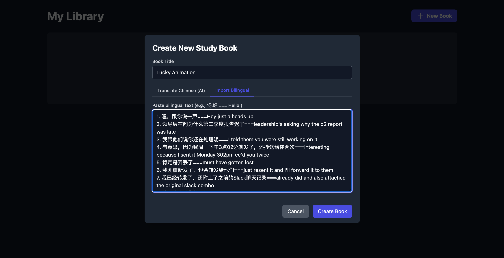

# FluentFlow AI - AI 赋能的英语学习应用

**FluentFlow AI** 是一款革命性的智能英语学习应用，旨在通过人工智能的力量帮助您高效掌握英语句子。它将科学的间隔重复记忆法与 Google Gemini 前沿的人工智能技术相结合，为您提供个性化的翻译练习、智能反馈和重点词汇提取，让语言学习变得前所未有的智能和高效。

## ✨ 应用截图

| 书库主页 (Library View) | 学习模式 (Study Session) |
| :---: | :---: |
|  |  |
| **AI 智能反馈 (AI Feedback)** | **创建学习本 (Book Creator)** |
|  |  |

## 🚀 功能特性

-   **🤖 智能创建学习卡片**: 只需粘贴中文句子，AI 将自动为您翻译成地道的英文，一键生成学习卡片集。您也可以直接导入中英双语对照文本。
-   **🧠 艾宾浩斯记忆曲线**: 内置基于艾宾浩斯遗忘曲线的间隔重复系统 (Spaced Repetition System)，在您即将忘记时智能安排复习任务，最大限度地提高记忆效率。
-   **💡 AI 智能评判**: 告别死板的单词匹配！Gemini AI 能够理解您翻译的句子含义。即使您的答案与标准答案不完全一样，只要意思正确，AI 也能判定为正确，并给予鼓励。
-   **📝 个性化反馈与纠错**: 当您翻译错误时，AI 不仅会给出正确答案，还会提供简洁明了的解释，告诉您错在哪里以及如何改进，帮助您真正理解。
-   **📚 自动生成生词本**: AI 会自动从您答错的句子中提取核心词汇，并生成您的专属生词本，让您能集中精力攻克难点。
-   **🎯 多种学习模式**:
    -   **学习模式 (Study Mode)**: 学习新卡片和到期应复习的卡片。
    -   **复习错题 (Review Mistakes)**: 专门针对您反复出错的句子进行强化训练。

## 🛠️ 技术栈

-   **前端**: React, TypeScript, Tailwind CSS
-   **核心 AI**: Google Gemini API (`@google/genai`)
-   **本地存储**: Browser `localStorage` for offline use

## 🏃 如何使用

1.  在 **书库 (Library)** 页面点击 **“创建新书”** 按钮。
2.  在创建页面，您可以选择 **“AI 翻译中文”** 模式（粘贴中文，AI 自动翻译）或 **“导入双语”** 模式（粘贴 `中文 === English` 格式的文本）。
3.  填写书名后，点击 **“创建”**。
4.  回到书库，选择您创建的书，点击 **“学习”** 或 **“复习错题”** 开始您的学习之旅。
5.  在学习界面，根据中文提示输入您的英文翻译。
6.  提交答案后，您会立即收到来自 AI 的智能反馈。
7.  答错的句子中的生词会被自动添加到您的生词本中。

##  roadmap 未来规划

我们致力于将 FluentFlow AI 打造成最懂你的语言学习伴侣。以下是我们的未来开发计划：

-   [ ] **单词本学习功能**: 为自动生成的生词本开发专属的学习和复习模式。
-   [ ] **发音练习与评测**: 集成 TTS（文本转语音）和 STT（语音转文本）技术，提供跟读功能，并由 AI 对您的发音进行打分和指导。
-   [ ] **数据云端同步**: 支持用户注册登录，将学习进度和词书同步到云端，实现跨设备学习。
-   [ ] **更丰富的学习内容**: 提供由社区或官方创建的预制学习本，涵盖四六级、托福雅思、商务英语等不同领域。
-   [ ] **学习统计与可视化**: 引入数据可视化图表，展示您的学习进度、记忆曲线、每日学习时长等，让进步清晰可见。

## 🤝 贡献

我们欢迎所有形式的贡献！如果您有任何想法、建议或发现了 Bug，请随时提交 [Issues](https://github.com/your-repo/fluentflow-ai/issues)。

如果您想贡献代码，请遵循以下步骤：

1.  Fork 本仓库
2.  创建您的特性分支 (`git checkout -b feature/AmazingFeature`)
3.  提交您的更改 (`git commit -m 'Add some AmazingFeature'`)
4.  推送到分支 (`git push origin feature/AmazingFeature`)
5.  提交一个 Pull Request

## 📄 许可证

本项目采用 MIT 许可证。详情请见 `LICENSE` 文件。
